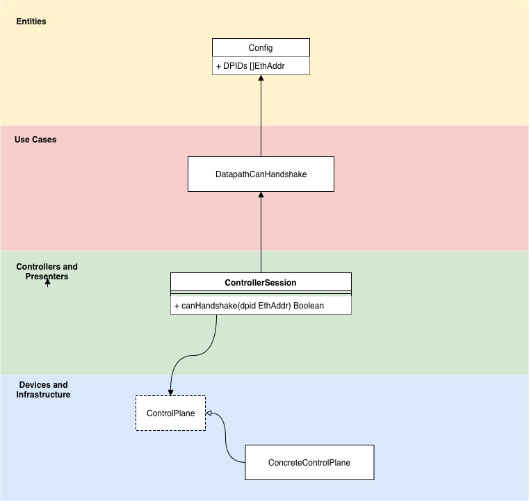

# Krios

## Requirements

* The controller should only handshake with switches it is configured to interact with, identified by MAC address.

## Architecture Brief

* The project will employ Clean Architecture principles and Domain Driven Design principles.
* The project will practice *package by component* to separate contexts.

## Abstractions

* Config

## Entities

* `Config`
  * `DPIDs[]EthAddr // Slice of Datapath IDs`

## Use Cases

* `DatapathCanHandshake`
  * Dependencies injected during init
  * Method `execute()`
    * Input: `dpid EthAddr`
    * Process:
      * Check if dpid in `Config.DPIDs`
    * Output: `Boolean` where `True` means datapath can handshake.

## Presenters/Controllers

* `ControllerSession`
  * Methods `canHandshake(dpid EthAddr) Boolean`

## Infrastructure

* `ControlPlane`, concrete `OpenFlowControlPlane`
  * `ConcreteControlPlane` is a `ControlPlane`
  * `ConcreteControlPlane` receives `ControllerSession` as an injected dependency.
  * `ConcreteControlPlane` should handle handshakes on it's own.
* `ConfigFile`, `ConfigRepository`, concrete `YAMLConfigRepository`

